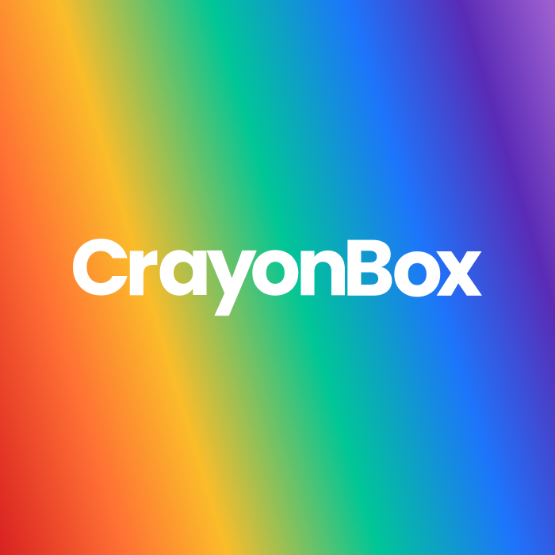
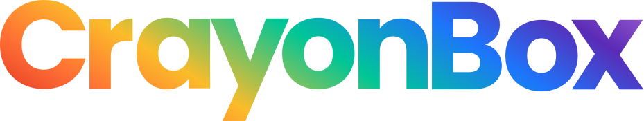
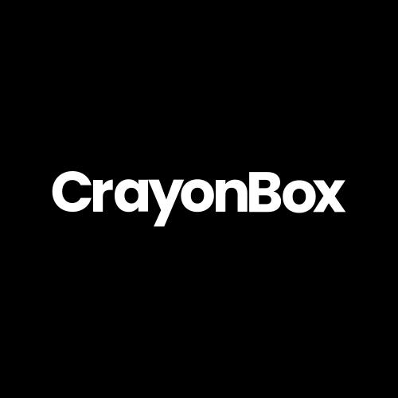
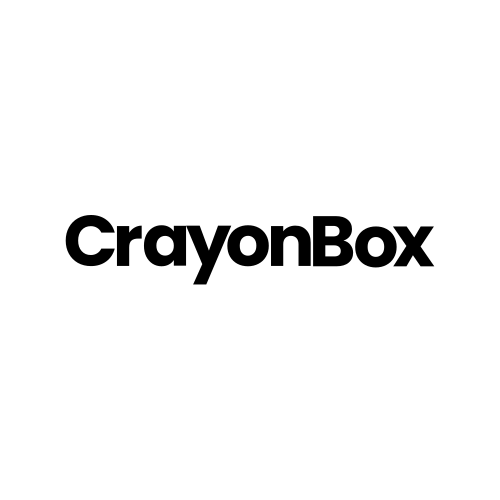
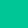
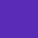
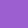

# 🎨 crayonbox.dev artwork

## Logos

|Variant|Logo|Wordmark|
|---|---|---|
|default|||
|download|[svg](./assets/logos/logo.svg), [png](./assets/logos/logo.png)|[svg](./assets/logos/logo-wordmark.svg), [png](./assets/logos/logo-wordmark.png)|
|black|||
|download|[svg](./assets/logos/logo--black.svg), [png](./assets/logos/logo--black.png)|[svg](./assets/logos/logo-wordmark--dark.svg), [png](./assets/logos/logo-wordmark--dark.png)|
|white|||
|download|[svg](./assets/logos/logo--white.svg), [png](./assets/logos/logo--white.png)|[svg](./assets/logos/logo-wordmark--light.svg), [png](./assets/logos/logo-wordmark--light.png)|

## Colors

|COLOR|NAME|HEX|CMYK|RGB|
|---|---|---|---|---|
||Red|`#D92121`|`0/85/85/15`|`rgb(217,33,33)`|
||Orange|`#FF7034`|`0/56/80/0`|`rgb(255,112,52)`|
||Yellow|`#FBBC2A`|`0/25/83/2`|`rgb(251,188,42)`|
||Green|`#00C696`|`100/0/24/22`|`rgb(0,198,150)`|
||Blue|`#1D75FB`|`88/53/0/2`|`rgb(29,117,251)`|
||Indigo|`#5A2BB6`|`51/76/0/29`|`rgb(90,43,182)`|
||Violet|`#9C5FD0`|`25/54/0/18`|`rgb(156,95,208)`|

## Typography

Poppins, Open Sans

## Legal

This work is licensed under [CC BY-NC-SA 4.0](./LICENSE)

## Credits

- The crayonbox.dev logo is designed by [Dimitri Kandassamy](https://github.com/dimitri-kandassamy)
